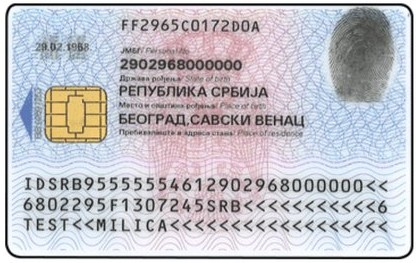
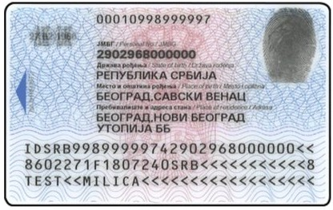

Погледајте предњу страну личне карте. Нађите ред **Важи до** испод датума издавања.

- Ако тај датум још није прошао, лична карта **важи**.
- Ако је датум прошао, лична карта **не важи** и треба вам нова.

## Са чипом или без чипа?

Постоје две врсте личне карте. Са предње стране изгледају скоро исто. Разлику видите на задњој страни.

1. Окрените личну карту.
2. Погледајте леву половину картице.

**Лична карта са чипом** има мали **златни квадрат** са линијама. То је чип. Адреса није одштампана на картици, налази се у чипу.

**Лична карта без чипа** нема златни квадрат. Ваша адреса је одштампана на задњој страни.

За регистрацију важе обе врсте личне карте: и са чипом и без чипа.
