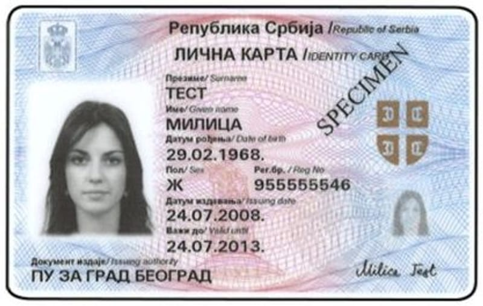

Погледајте предњу страну личне карте. Нађите ред **Важи до** испод датума издавања.

- Ако тај датум још није прошао, лична карта **важи**.
- Ако је датум прошао, лична карта **не важи** и треба вам нова.

За регистрацију важе обе врсте личне карте: и са чипом и без чипа.
