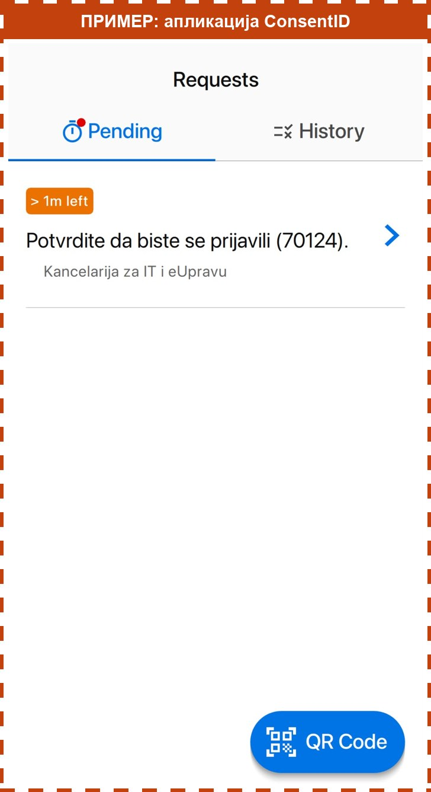
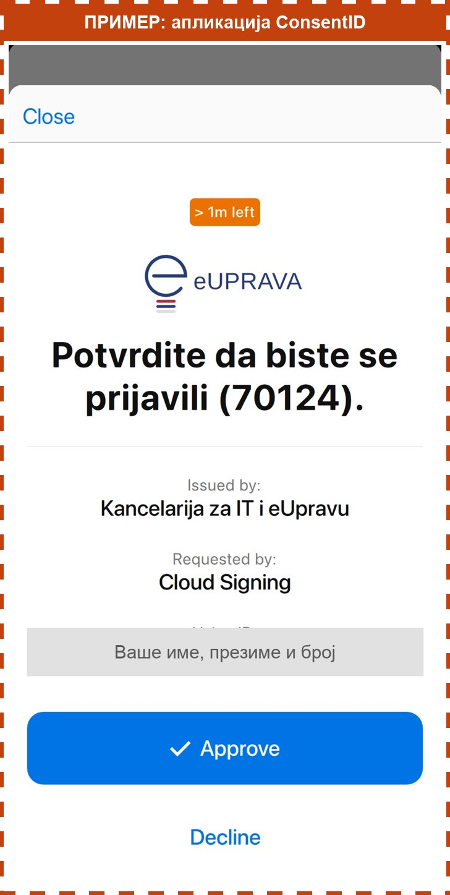
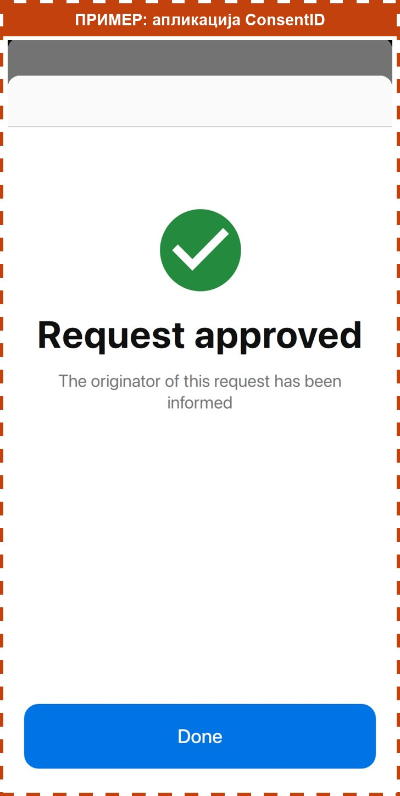

> Ово радите у апликацији ConsentID на телефону, не у водичу. Слике су само пример, на њих не треба да притискате.

## Који ПИН вам треба

Апликација тражи **ПИН за ConsentID**. То је број од **6 цифара** који сте **сами смислили**. Смислили сте га када сте први пут активирали апликацију, на шалтеру или код куће.

- То **није** ПИН од платне картице.
- То **није** шифра којом откључавате телефон.

## Потврдите пријаву

1. Отворите апликацију **ConsentID** на телефону.
2. Упишите свој ПИН за ConsentID.
3. На екрану **Захтеви** (на енглеском **Requests**) видите поруку „Потврдите да бисте се пријавили“. Притисните је.

4. Притисните плаво дугме **Потврди** (на енглеском **Approve**).

5. Појавиће се зелена квачица. Притисните плаво дугме на дну (на енглеском **Done**).

Сада сте пријављени на сајт eid.gov.rs.

Ако је прошло више од једног минута, захтев истиче. Притисните **Време је истекло** и пријавите се поново.
