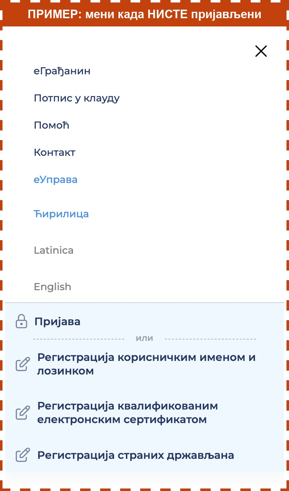

Најчешћи разлог је да сте у међувремену **одјављени** са сајта eid.gov.rs. То се деси ако је прошло неколико минута. Пријавите се поново.

## Како да проверите да ли сте пријављени

1. Притисните дугме **Отворите сајт eid.gov.rs**, на дну екрана. Сајт ће се отворити у новој картици.
2. Горе десно притисните дугме са **три црте**. Отвориће се мени.
3. Погледајте дно менија:
   - Ако пише **Пријава** и **Регистрација**, **нисте пријављени**. Вратите се у водич и притисните **Нисам пријављен/а**.
   - Ако видите **Услуге** и своје име или имејл, **пријављени сте**. Вратите се у водич и притисните **Пријављен/а сам, покушаћу поново**.

Слика испод је само пример како изгледа мени када нисте пријављени. Није права, на њу не треба да притискате.

Ако на сајту пише да је сертификат у клауду **већ активан**, значи да сте га већ укључили. Притисните **Сертификат је већ активан**.
