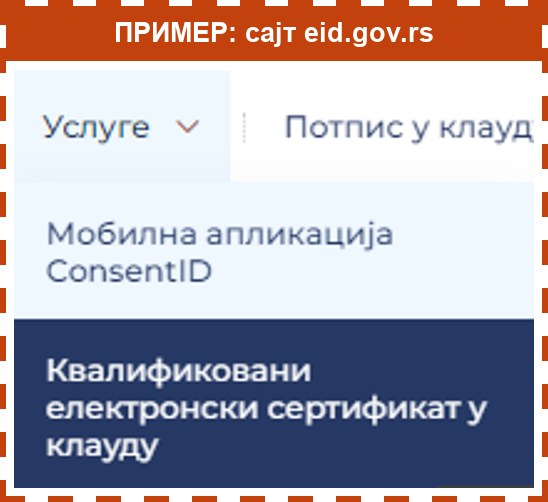
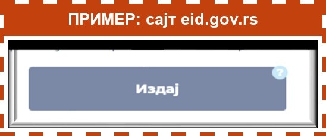
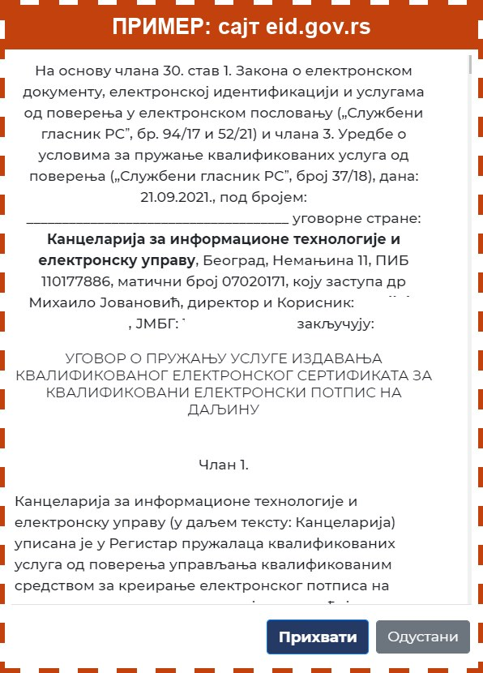
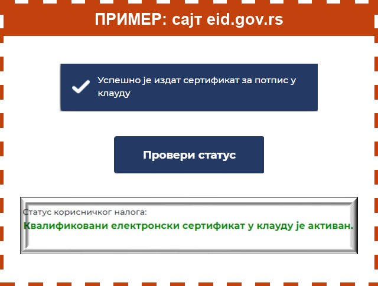

> Ово радите на сајту eid.gov.rs, где сте се управо пријавили, не у водичу. Слике су само пример, на њих не треба да притискате.

Притисните дугме **Отворите сајт eid.gov.rs**, на дну ове стране. Сајт ће се отворити у новој картици, а ви сте и даље пријављени.

1. На сајту отворите мени и притисните **Услуге**.
2. Изаберите **Квалификовани електронски сертификат у клауду**.

3. Притисните дугме **Издај**.

4. Појавиће се уговор. Не морате све да читате. Померите надоле и притисните **Прихвати**.

5. Појавиће се порука да је сертификат издат. Притисните **Провери статус**.
6. Када пише **„Квалификовани електронски сертификат у клауду је активан“**, готово је.

Уговор ће вам стићи и на имејл. Сачувајте га.
