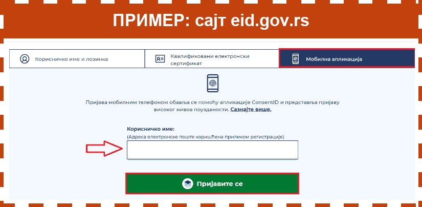

1. Притисните дугме **Отворите пријаву на eid.gov.rs**, на дну екрана. Страница за пријаву ће се отворити у новој картици.
2. Горе су три сличице. Притисните **трећу, десно**, са сличицом телефона. То је пријава мобилном апликацијом. На рачунару уместо сличица пише **Мобилна апликација**.
3. У поље **Корисничко име** упишите своју имејл адресу.
4. Притисните зелено дугме **Пријавите се**.

Слика испод је само пример како изгледа страница за пријаву на рачунару. Није права, на њу не треба да притискате.

Чим притиснете **Пријавите се**, на телефон стиже захтев у апликацији ConsentID. Вратите се овде и притисните **Даље**. Имате око **један минут**.
