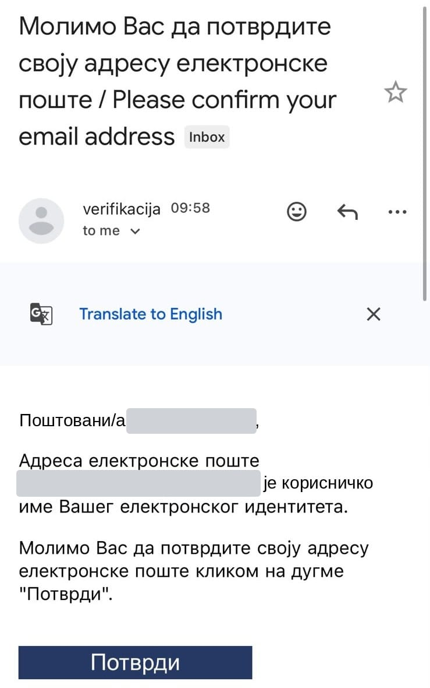

Отворите своју имејл пошту. Стигла је порука од **verifikacija**, са насловом „Молимо Вас да потврдите своју адресу електронске поште“.

1. Отворите поруку.
2. Притисните плаво дугме **Потврди**.

Дугме **Потврди** морате притиснути **у року од 24 сата** од регистрације. Ако прође више, мораћете да се региструјете поново.

