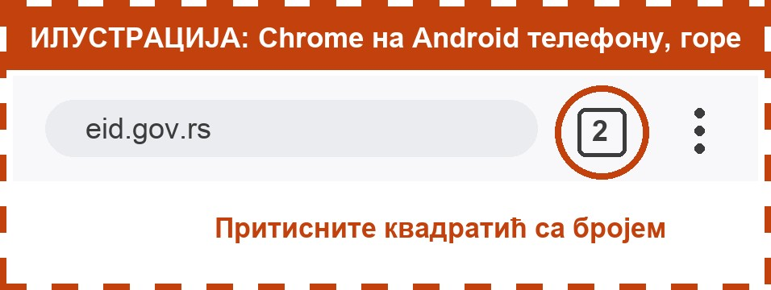

Где је дугме са квадратићима, зависи од телефона. Зависи и од прегледача (програма у ком отварате сајтове, на пример Chrome или Safari).

**iPhone, Chrome:** доле, квадратић са бројем. Број показује колико је картица отворено.

**iPhone, Safari:** доле десно, 2 квадратића један преко другог.

**Android телефон, Chrome:** горе десно, поред адресе, квадратић са бројем.

Ако не налазите дугме, замолите неког од породице или комшија да вам покаже једном. После ћете знати сами. Притисните **Даље**.
