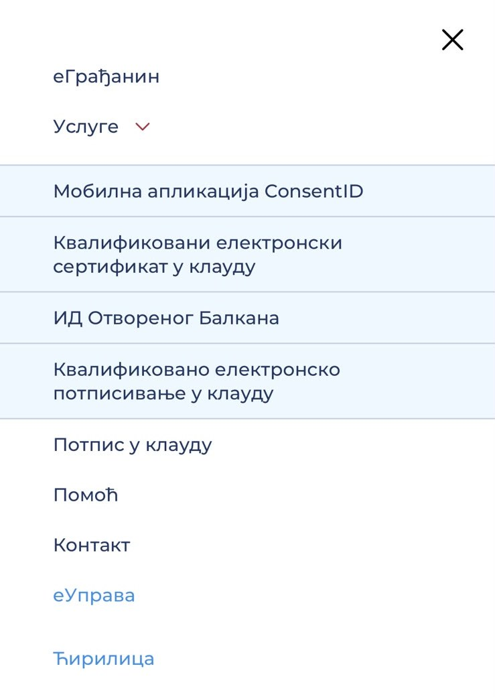

> Ово радите у продавници апликација на телефону, не у водичу. Слике су само пример. Не притискајте их.

ConsentID је бесплатна апликација којом потврђујете да сте то ви.

1. Притисните линк за свој телефон:
   - **Android телефон:** [Отворите ConsentID у продавници Google Play](https://play.google.com/store/apps/details?id=nl.aeteurope.mpki.gui)
   - **iPhone:** [Отворите ConsentID у продавници App Store](https://apps.apple.com/us/app/consentid/id883224643)
2. Отвориће се продавница апликација, на страници апликације ConsentID.
3. Притисните **Инсталирај** (на енглеском **Install** или **Get**).
4. Када се инсталира, вратите се у водич.

Ако желите да прочитате више о апликацији, то пише на сајту eid.gov.rs, у менију **Услуге → Мобилна апликација ConsentID**. Слика испод је само пример како изгледа тај мени.

