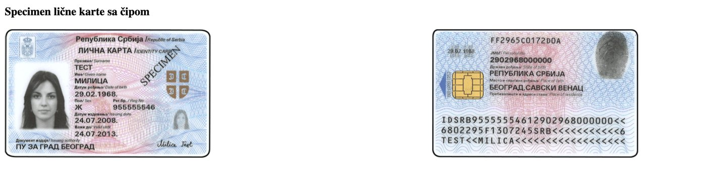

На регистрацији ћете приложити фотографије личне карте. Боље је да их направите сада.

1. Ставите личну карту на сто, на тамну подлогу.
2. Упалите светло, али пазите да се на личној карти не сија одсјај.
3. Фотографишите **предњу** страну. Сва четири угла морају да се виде.
4. Окрените личну карту и фотографишите **задњу** страну.

Ако се региструјете пасошем, фотографишите страну са својом сликом.

Ако фотографишете туђим телефоном, после обришите фотографије са њега.
