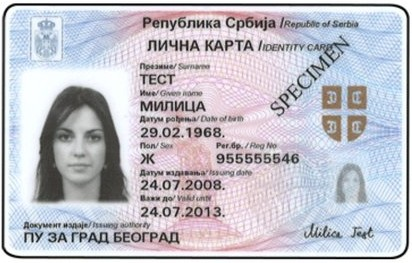

**Ово радите у формулару на сајту eid.gov.rs, не на овој страни.** На овој страни само читате шта да урадите.

Да пређете на формулар: притисните дугме са квадратићима (понекад има број), на дну или на врху екрана. Затим притисните страницу **eid.gov.rs**.

Следећа три поља у формулару су о вашој личној карти. Узмите је у руке.

1. **Тип документа**: притисните поље и изаберите **Лична карта**. Ако се региструјете пасошем, изаберите **Пасош**.
2. **Број документа**: препишите број поред **Рег. бр.** са предње стране личне карте.
3. **Датум истека документа**: изаберите датум из реда **Важи до** са предње стране.

Где су ти подаци на личној карти:

Када завршите, вратите се на ову страну на исти начин и притисните **Даље**.
