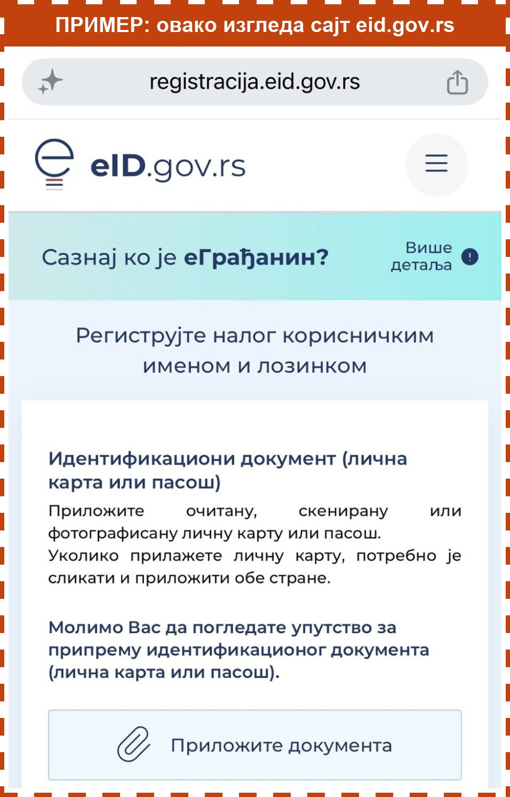

> Ово радите на сајту eid.gov.rs, не у водичу. Слике су само пример. Не притискајте их.

Притисните дугме **Отворите регистрацију**, на дну екрана. Формулар ће се отворити у новој картици, на сајту eid.gov.rs. Тим налогом се пријављујете на еУправу.

Овај водич остаје отворен у другој картици. Формулар попуњавате тамо, а у водичу читате шта да упишете.

Како прелазите између картица, пише на екрану „Како да прелазите између картица“, на почетку водича.

## Како да знате где сте

**Водич**: горе пише **еГрађанин корак по корак**, а дугмад су плава. У водичу само читате шта треба да урадите.

**Формулар** (сајт eid.gov.rs): горе је лого са словом **е** и пише **eID.gov.rs**. Ту уписујете своје податке.

Слика испод је само пример како изгледа сајт eid.gov.rs.

Када видите формулар, вратите се у водич. Не затварајте ниједну картицу. Притисните **Видим формулар**.
