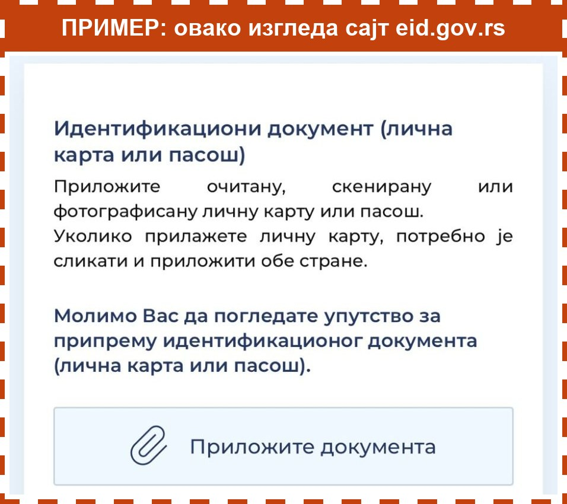
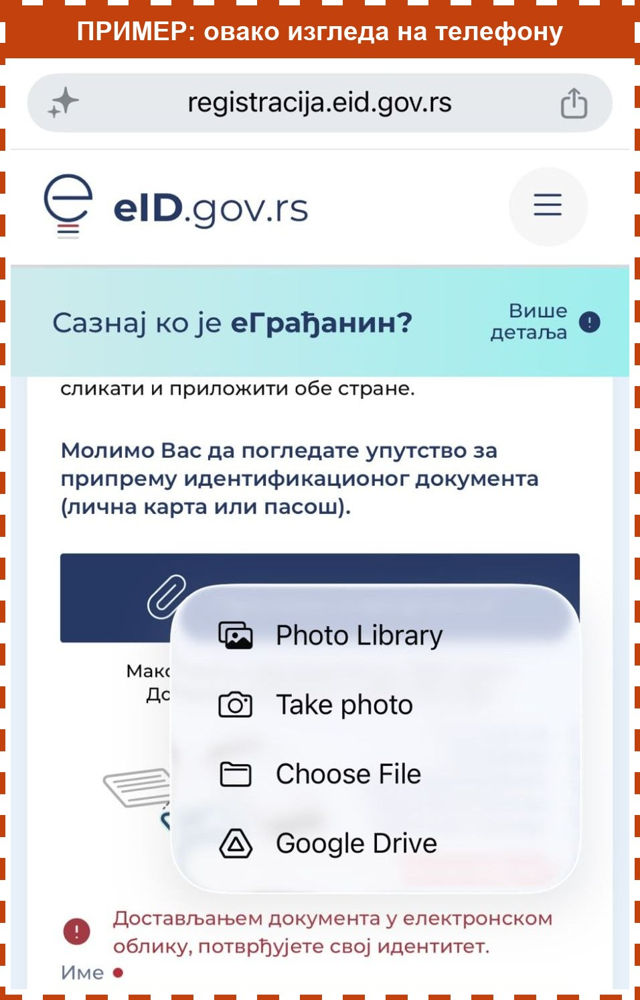

**Ово радите у формулару на сајту eid.gov.rs, не на овој страни.** Слике у наранџастом оквиру су само пример. На њих не треба да притискате.

Да пређете на формулар: притисните дугме са квадратићима (понекад има број), на дну или на врху екрана. Затим притисните страницу **eid.gov.rs**.

Прво што формулар тражи су фотографије личне карте. Приложићете две слике: **предњу** и **задњу** страну.

Слика испод је само пример како изгледа сајт eid.gov.rs. Није права, на њу не треба да притискате.

У формулару урадите ово:

1. Притисните дугме **Приложите документа**.
2. Отвориће се мали мени. Притисните ставку са сличицом слика. Тако бирате фотографије које сте већ направили.
3. Додирните фотографију **предње** стране личне карте.
4. Поново притисните **Приложите документа**.
5. Изаберите фотографију **задње** стране.

Слика испод је само пример како изгледа мени на iPhone-у подешеном на енглески језик. Није права, на њу не треба да притискате.

## Шта пише у менију

Натписи зависе од телефона и од језика на телефону.

**На iPhone-у:**

- **Фототека** (на енглеском **Photo Library**): фотографије које сте већ направили. Ово изаберите.
- **Сликај** (на енглеском **Take photo**): сликате личну карту сада.
- **Изабери фајл** (на енглеском **Choose File**): не треба вам.

**На Android телефону:**

- **Галерија** или **Фотографије**: фотографије које сте већ направили. Ово изаберите.
- **Камера**: сликате личну карту сада.
- **Фајлови** или **Датотеке**: не треба вам.

Када су обе слике приложене, испод дугмета видите њихове називе.

Ако се региструјете пасошем, приложите само страну са својом сликом.

Када завршите, вратите се на ову страну на исти начин и притисните **Даље**.
