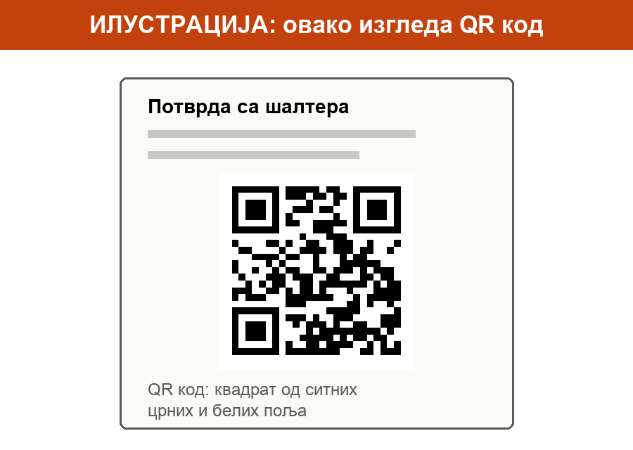
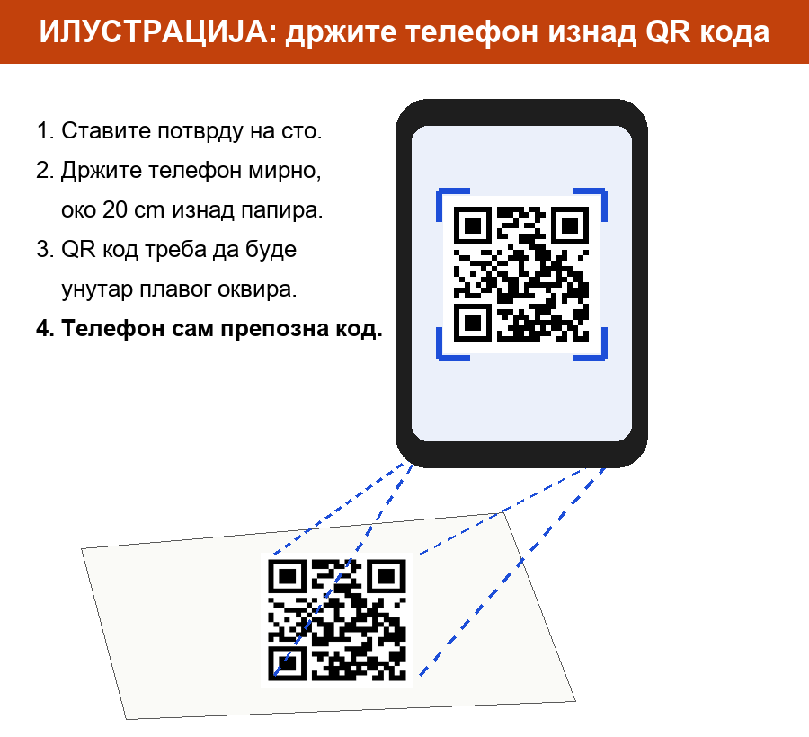

> Ово радите у апликацији ConsentID на телефону, не у водичу. Слике су само пример. Не притискајте их.

## Шта је QR код

QR код је квадрат од ситних црних и белих поља. Налази се на потврди са шалтера. Телефон га „прочита“ камером, као што ви читате текст. Не треба да га фотографишете.

## Скенирајте QR код

1. У апликацији притисните **Скенирајте QR код**. Телефон вас може питати да ли апликација сме да користи камеру. Притисните **Дозволи** (на енглеском **Allow** или **OK**).
2. На екрану телефона сада видите оно што види камера.
3. Ставите потврду на сто, да лежи равно.
4. Држите телефон изнад потврде, око 20 cm, као да хоћете да је сликате.
5. Полако померајте телефон док QR код не буде на средини екрана, унутар оквира.
6. Држите телефон мирно неколико секунди. **Ништа не притискајте.** Телефон сам препозна код.

## Како знате да је успело

На екрану се појаве ваше **име**, **презиме** и **ИД корисника**. То значи да је апликација укључена.

## Ако скенирање не успе

- Упалите светло и пазите да на папиру нема сенке.
- Мало удаљите или приближите телефон.
- Ако ни тада не иде, апликација нуди да кодове упишете ручно. На потврди су два броја: **кориснички ИД** и **регистрациони код**. Препишите их тачно.

Када је апликација укључена, на еУправу се пријављујете потврдом на телефону.
