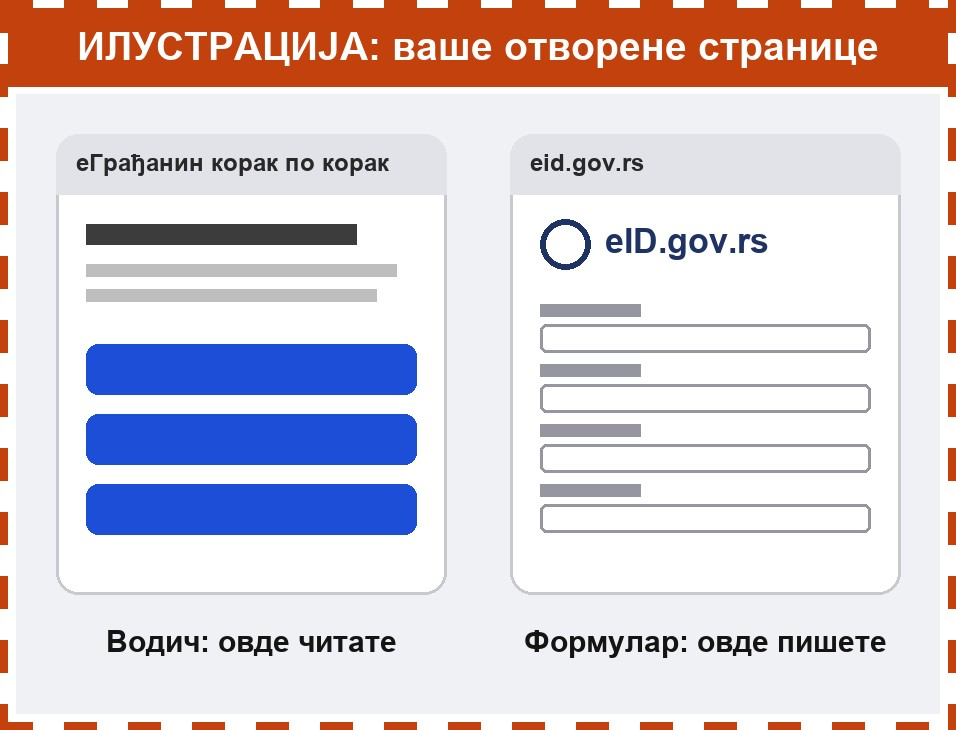
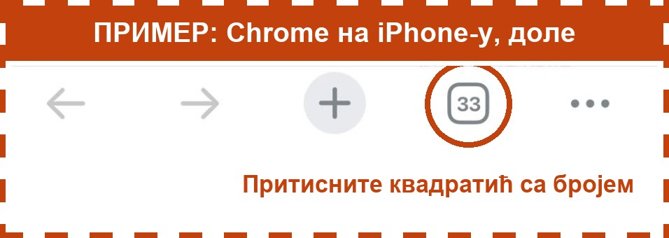
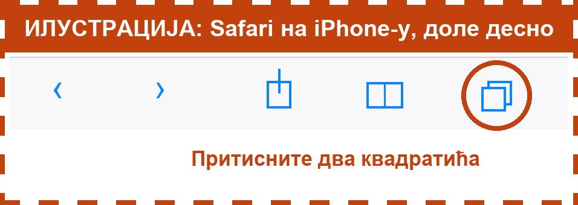

Ово је важно да знате пре него што почнете. Мало вежбе сада ће вам много олакшати касније.

## Шта је картица

Нека дугмад у овом водичу отварају **други сајт**, на пример сајт за регистрацију. Тај сајт се отвара у **новој картици**.

Водич се **не затвара**. Остаје отворен у својој картици, као два листа папира један испод другог. На једном читате упутство, на другом попуњавате формулар.

## Како да пређете са једне на другу

Дугме са квадратићима је на дну или на врху екрана. Где тачно, зависи од телефона. Погледајте слике испод.

1. Притисните дугме са квадратићима.
2. Видећете све отворене картице, као мале слике.
3. Притисните ону која вам треба:
   - **еГрађанин корак по корак** је овај водич,
   - **eid.gov.rs** или други сајт је место где нешто попуњавате.

Тако можете да идете напред и назад колико год пута треба. Ништа се неће изгубити.

## Где је дугме са квадратићима

**iPhone, Chrome:** доле, квадратић са бројем. Број показује колико је картица отворено.

**iPhone, Safari:** доле десно, два квадратића један преко другог.

**Android телефон, Chrome:** горе десно, поред адресе, квадратић са бројем.

Ако не налазите дугме, замолите неког од породице или комшија да вам покаже једном. После ћете знати сами.
