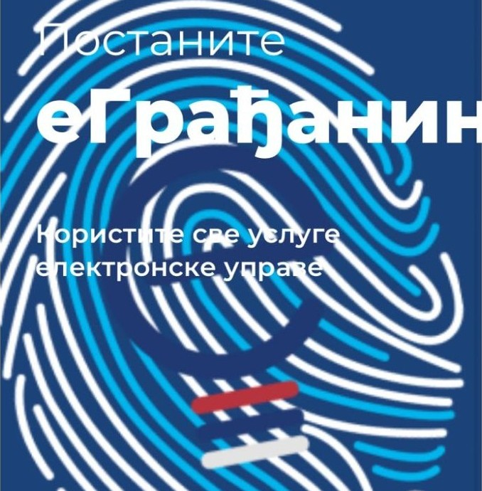

Послове са државом завршите од куће, са телефона или рачунара. Потребан вам је само један бесплатан налог.

## Зашто да се региструјете

- **Без чекања у реду.** Захтеве шаљете од куће. Термин у полицијској станици бирате сами, у календару.
- **Један налог за све.** Истим налогом се пријављујете на еУправу, еЗдравље, Портал ЛПА за порез и есДневник.
- **Документа стижу вама.** Изводи, уверења и решења стижу у ваше еСандуче (електронско сандуче за документа од државе).
- **Мање папира.** Уз захтев за извод не прилажете ниједан документ.
- **Бесплатно је.** Регистрација и апликација ConsentID се не плаћају. Електронски извод из матичне књиге је без таксе.

## Шта све можете

- **Лична документа:** закажите термин за личну карту или пасош, за себе и до четири члана породице.
- **Изводи и уверења:** извод из матичне књиге рођених, венчаних или умрлих стиже у еСандуче. Можете тражити и уверење о држављанству и о пребивалишту.
- **Деца и школа:** пријавите дете у вртић без папира. Пратите оцене и изостанке у есДневнику.
- **Здравље:** закажите преглед код свог лекара. Погледајте налазе и рецепте.
- **Порез:** проверите порез на имовину и платите га преко интернета.

И још стотине других услуга.

## Како да постанете еГрађанин

1. **Региструјте се.** Од куће, бесплатно, уз фотографију личне карте или пасоша. Налог се активира најкасније за 48 сати.
2. **Активирајте апликацију ConsentID.** Бесплатна апликација на телефону којом потврђујете да сте то ви. Активирате је једном, QR кодом који добијете на шалтеру. Са њом добијате изводе, уверења и еСандуче.
3. **Укључите потпис у клауду.** Није обавезно. Документа потписујете на телефону, без посебног уређаја.

## Налог и апликација нису исто

- **Налог** су корисничко име (ваш имејл) и лозинка. Правите га од куће. Са њим можете да закажете термин за личну карту или пасош и да проверите порез.
- **Апликација ConsentID** је додатак уз налог. Активирате је једном, QR кодом који добијете на шалтеру. Тек са њом добијате изводе, уверења и еСандуче.

Прво направите налог, па тек онда активирајте апликацију. Ако већ имате налог, прескачете први део.

## Шта вам треба

- важећа лична карта или пасош,
- навршених 16 година,
- имејл адреса,
- паметни телефон, за апликацију ConsentID.

## Одакле да почнете

Немате налог? Почните од регистрације.

Већ имате налог на еУправи? Пређите на активацију апликације ConsentID.
