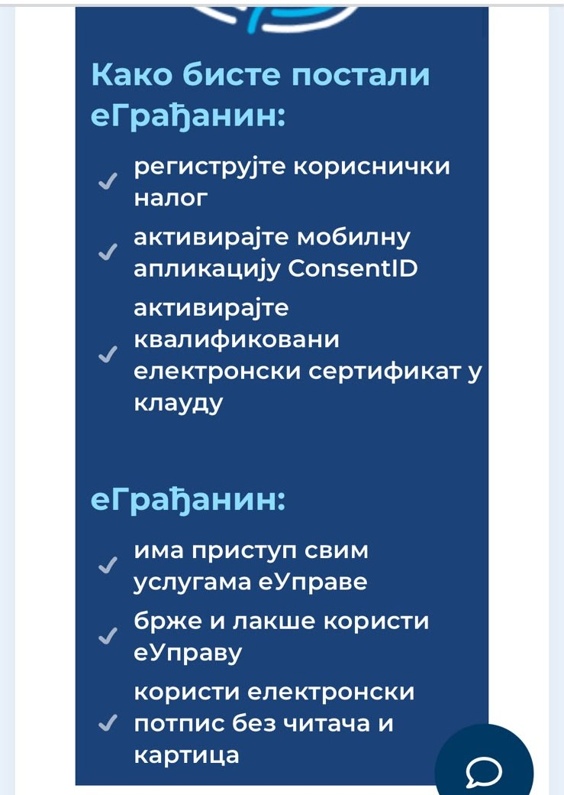

Са једним бесплатним налогом на Порталу еУправа:

- заказујете термин за личну карту или пасош,
- уписујете дете у вртић,
- добијате извод из матичне књиге,
- проверавате и плаћате порез.

Све то са телефона или рачунара, без чекања у реду.

Регистрација је бесплатна. Водимо вас корак по корак.
